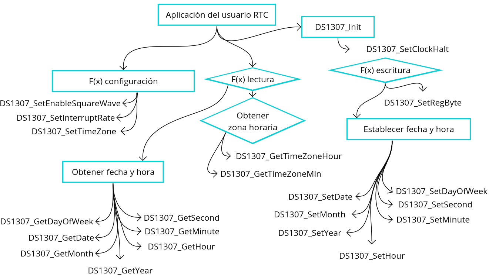

## Funciones de la API `time_rtc.h`

### Inicialización

- `void time_rtc_Init(I2C_HandleTypeDef *hi2c)`: Inicializa el RTC DS1307 y configura el puerto I2C.

### Obtener Fecha y Hora

- `void time_rtc_GetFormattedDateTime(char *buffer, size_t buffer_size)`: Obtiene la fecha y hora formateadas como una cadena en el formato ISO 8601.
- `void time_rtc_PrintFormattedDateTime(void)`: Imprime la fecha y hora formateadas directamente en la consola.

### Configuración de la Hora Inicial

- `void DS1307_SetInitialTime(I2C_HandleTypeDef *hi2c, int8_t timeZoneHour, uint8_t timeZoneMin, uint8_t date, uint8_t month, uint16_t year, uint8_t dayOfWeek, uint8_t hour, uint8_t minute, uint8_t second)`: Configura la hora inicial del RTC DS1307.

## Utilización

1. Inicializa la comunicación I2C con el DS1307 llamando a `time_rtc_Init()`.
2. Utiliza las funciones de configuración para ajustar los parámetros del DS1307 según tus necesidades.
3. Emplea las funciones de lectura para obtener la fecha, hora y zona horaria actuales del DS1307.
4. Utiliza las funciones de escritura para establecer la fecha, hora y otros parámetros en el DS1307.

Para más detalles sobre cada función y sus parámetros, consulta el archivo de encabezado `rtc_ds1307_for_stm32_hal.h`.

## Esquema 

## Licencia

Esta biblioteca se distribuye bajo la Licencia Pública General de GNU v3.0. Consulta el archivo de licencia para obtener más información sobre los términos y condiciones de uso.

### Estructura del Repositorio

El repositorio está organizado de la siguiente manera:
├── APIs
│   ├── Inc
│   │   ├── LICENSE
│   │   ├── rtc_ds1307_for_stm32_hal.h
│   │   ├── time_rtc.h
│   │   └── uart.h
│   └── Src
│       ├── rtc_ds1307_for_stm32_hal.c
│       ├── time_rtc.c
│       └── uart.c
  
